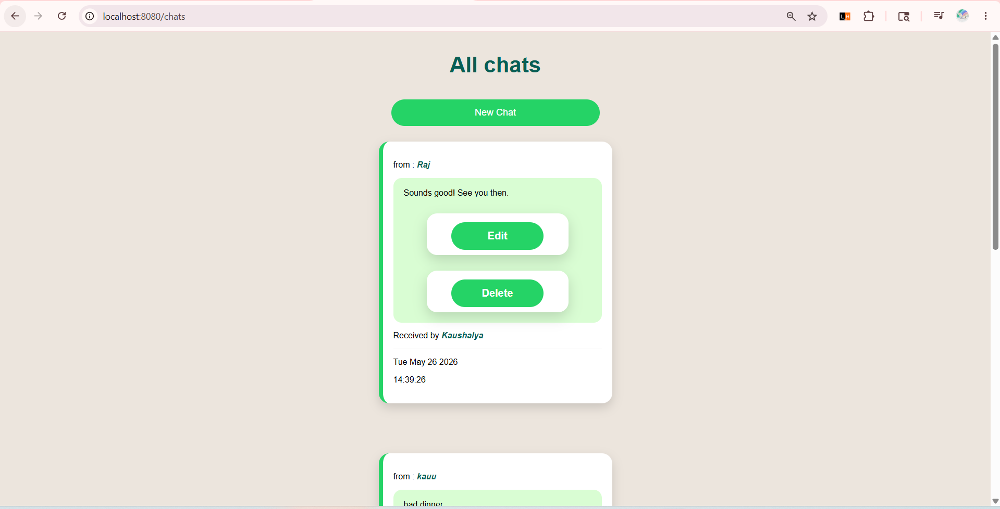
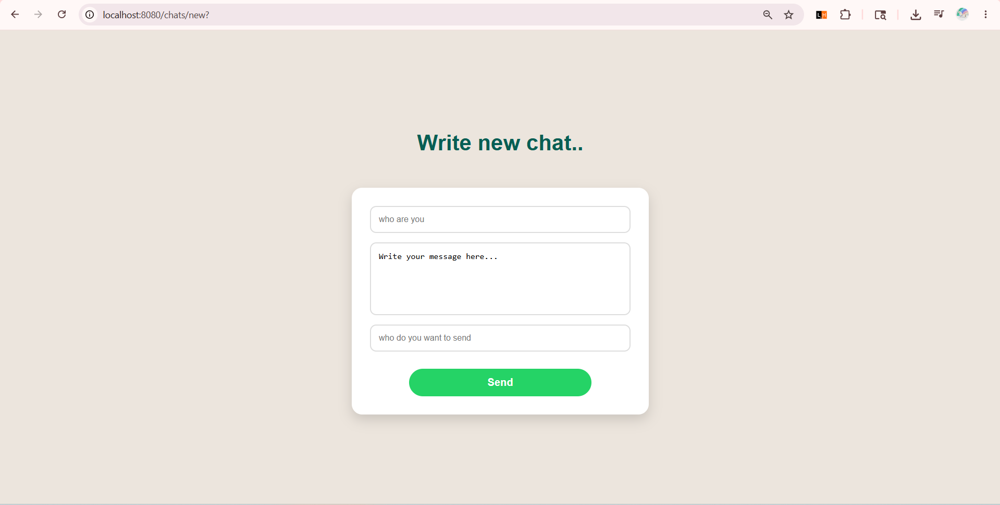
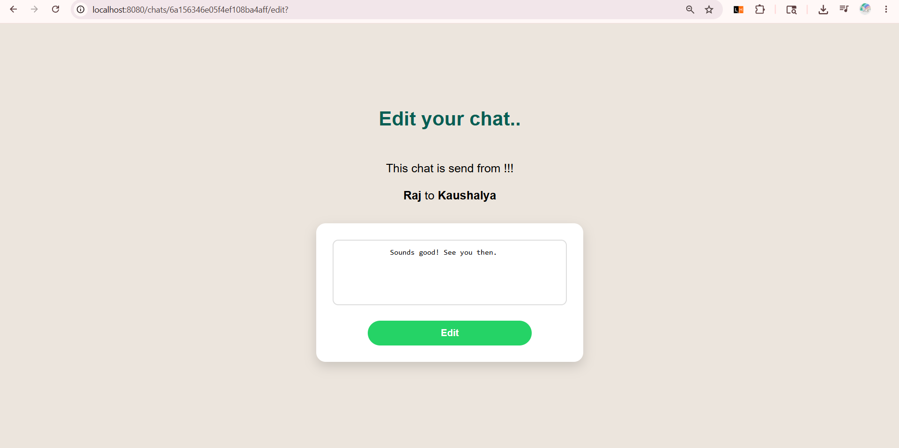
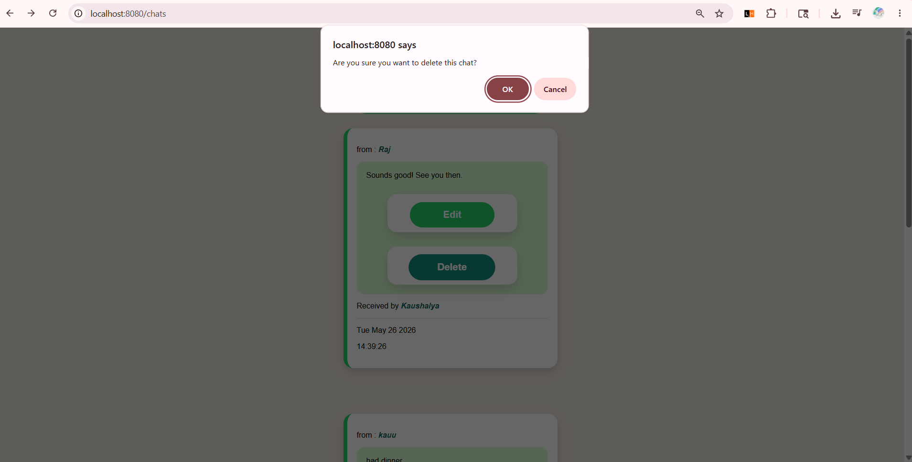

# Mini WhatsApp Clone

A simple chat application built using Node.js, Express.js, MongoDB, and EJS.

This project allows users to create, edit, view, and delete chats with a clean WhatsApp-inspired interface.

## Features

- Create new chats
- View all chats
- Edit existing chats
- Delete chats with confirmation popup
- Responsive and clean UI
- MongoDB database integration

## Tech Stack

- Node.js
- Express.js
- MongoDB
- Mongoose
- EJS
- CSS
- Method-Override

## Installation

1. Clone the repository

```bash
git clone https://github.com/Rapanzo39/mini-whatsapp-clone.git
```

2. Install dependencies

```bash
npm install
```

3. Start MongoDB

4. Run the project

```bash
node app.js
```

5. Open in browser

```bash
http://localhost:8080/chats
```

## Learning Outcomes

Through this project, I learned:

- CRUD operations
- RESTful routing
- MongoDB integration
- EJS templating
- Form handling
- Delete confirmation popup using JavaScript

## Future Improvements

- User authentication
- Real-time messaging using Socket.io
- Better UI animations
- Mobile responsiveness


## Screenshots

### All Chats Page


### Send New Chat


### Edit Chat


### Delete Confirmation Popup

